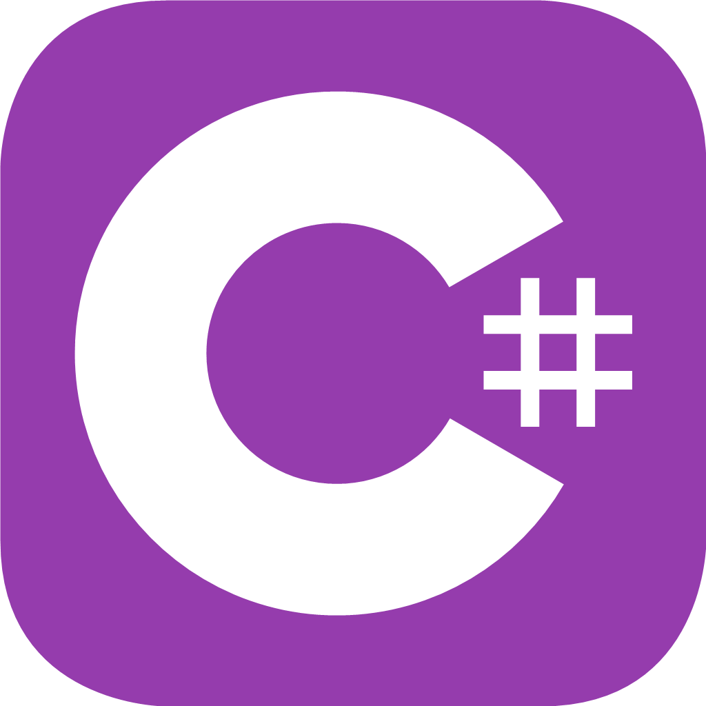
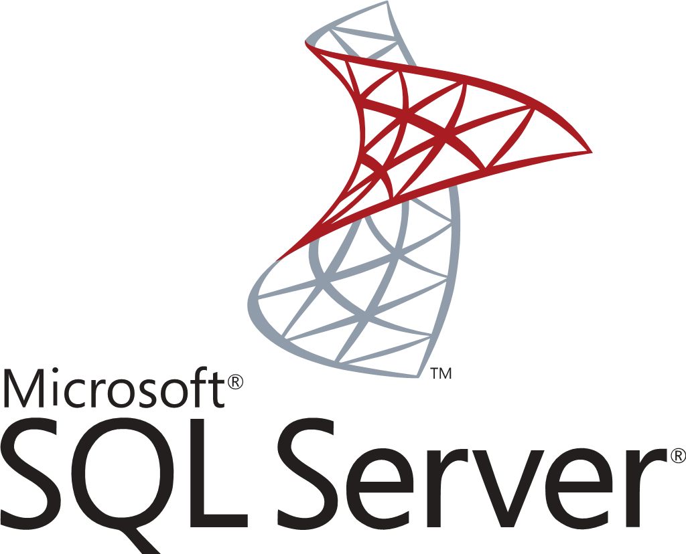

### pardon14
---

  

---
#### About Me
---

Degree: IT - spec. Database Administrator

I am passionate about SQL and programming in C#. I love creating queries, optimizing databases and developing database management skills. C# fascinates me because of its potential in creating a variety of applications. I am constantly learning and look forward to future projects that will allow me to use these languages in practice.

---

#### I can code in...

  
  
  
  
  
  
  

---
#### I can speak in..

  
  

---
<a href="https://icons8.com/icon/set/flags/fluency" title="flags">Flag icons from icons8.com</a>
