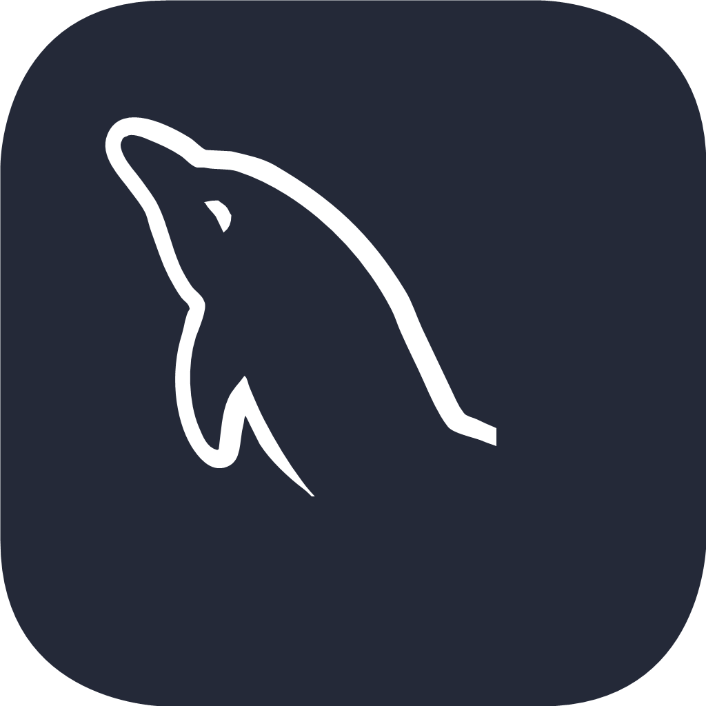

### pardon14
---

  

---
#### About Me
---

Degree: IT - spec. Database Administrator

I am passionate about SQL and programming in C#. I love creating queries, optimizing databases and developing database management skills. C# fascinates me because of its potential in creating a variety of applications. I am constantly learning and look forward to future projects that will allow me to use these languages in practice.

---

#### I can code in...

  
  
  
  
  
  
  

<!--
**pardon14/pardon14** is a ✨ _special_ ✨ repository because its `README.md` (this file) appears on your GitHub profile.

Here are some ideas to get you started:

- 🔭 I’m currently working on ...
- 🌱 I’m currently learning ...
- 👯 I’m looking to collaborate on ...
- 🤔 I’m looking for help with ...
- 💬 Ask me about ...
- 📫 How to reach me: ...
- 😄 Pronouns: ...
- ⚡ Fun fact: ...
-->
